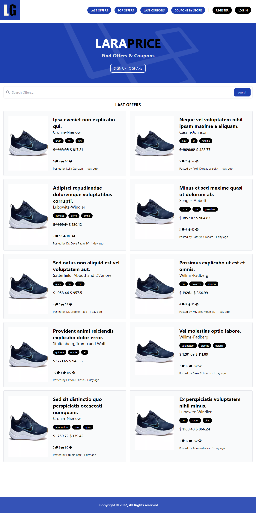

<h1 align="center">
  <strong>LaraPrice</strong>
</h1>

<p align="center">
 <a href="#about">About</a> |
 <a href="#usage">Usage</a> |
 <a href="#technologies">Technologies</a> |
 <a href="#license">License</a>
</p>

---

## About

An application to share offers & coupons. LaraPrice was developed using PHP Language and Laravel Framework.<br>
This is a non-profit project. All prototypes, software code, design and illustrations are created for educational purposes only.



---

## Usage

Before you begin, you will need to have the following tools installed on your machine:
<strong><a href="https://www.php.net/">PHP</a></strong>, <strong><a href="https://getcomposer.org/">Composer</a></strong>, <strong><a href="https://git-scm.com/">Git</a></strong>, and <strong><a href="https://nodejs.org/">Node</a></strong>.<br>
In addition, it is good to have an editor to work with the code like <strong><a href="https://code.visualstudio.com/">VSCode</a></strong> or <strong><a href="https://www.jetbrains.com/phpstorm/">PHP Storm</a></strong>.

### Installation
First, clone this repository, install the dependencies, and setup your <code>.env</code> file.
```bash
$ git clone https://github.com/brunopas/laravel-price.git
$ cd laravel-price

$ composer install
$ cp .env.example .env
```
This app uses <strong><a href="https://www.mysql.com/">MySQL</a></strong>. To use something different, open up <code>config/Database.php</code> and change the default driver.<br>
To use MySQL, make sure you install it, setup a database and then add your DB credentials (database, username and password) to the <code>.env</code> file.

### Database Setup
Then, create the necessary database.
```bash
php artisan db
$ create database laravel_price
```

### Migrations
Finally, run the initial migrations and seeders.
```bash
$ php artisan migrate --seed
```

### File Uploading
When uploading files, they go to "storage/app/public". Create a symlink with the following command to make them publicly accessible.
```bash
$ php artisan storage:link
```

### Running The App
To serve the application on the PHP development server, run the following command:
```bash
$ php artisan serve
```

---

## Technologies

The following tools were used to build the project:
-   **[PHP](https://www.php.net/)** >= 8.0.2
-   **[Laravel Framework](https://laravel.com/)** >= 9.19
-   **[Tailwind CSS](https://tailwindcss.com/)**
-   **[MySQL](https://www.mysql.com/)**

For more information, see the files [composer.json](./composer.json) and [package.json](./package.json).

---

## License

This project is under the license [MIT](./LICENSE).

Made with ❤️ love by Bruno Pasquarelli Macedo 👋🏻 [Get in Touch!](https://www.linkedin.com/in/brunopasmacedo)
